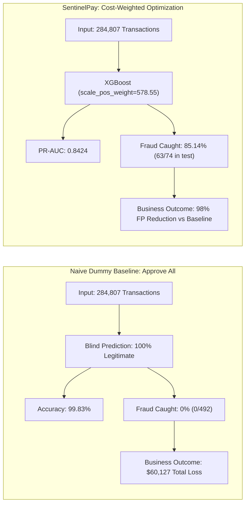
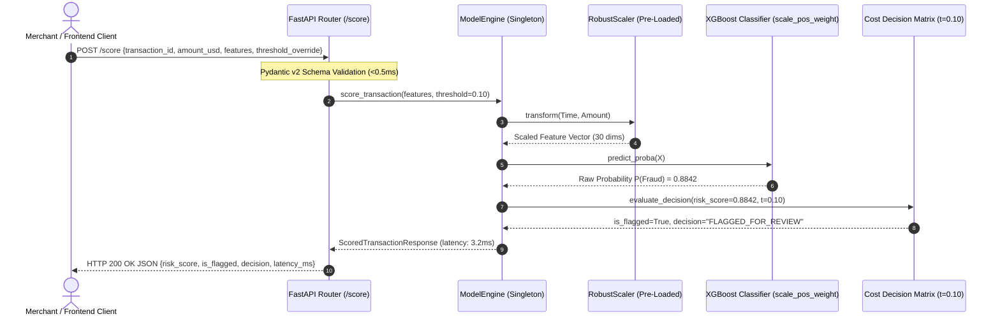
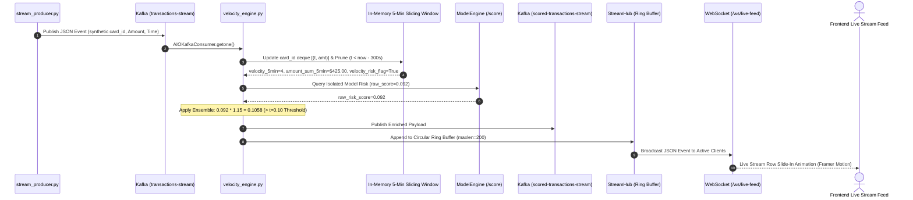
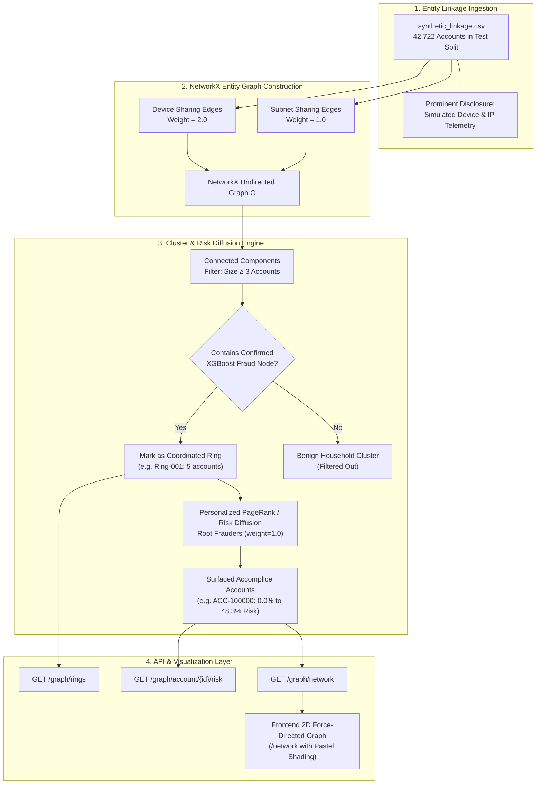
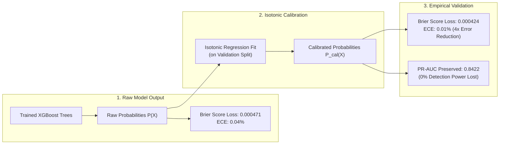
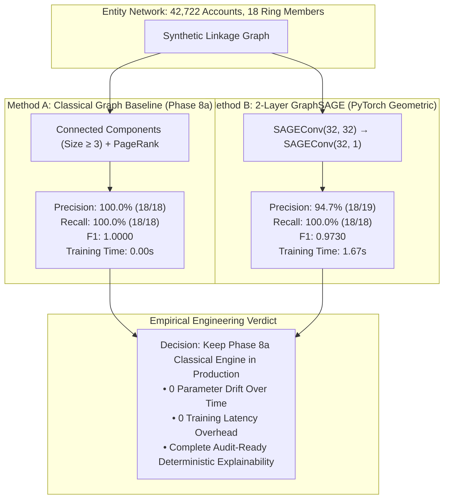

# SentinelPay 🛡️
> **Real-Time Fraud Intelligence Engine & Dispute Evidence Generator for Extreme Class Imbalance (0.17%)**

[](https://python.org)
[](https://xgboost.readthedocs.io)
[](https://fastapi.tiangolo.com)
[](https://shap.readthedocs.io)
[](https://kafka.apache.org)
[](https://networkx.org)
[](https://pyg.org)
[](https://nextjs.org)
[](https://docker.com)
[](https://sentinelpay-seven.vercel.app)
[](https://railway.app)
[](LICENSE)

---

## 📑 Table of Contents

1. [The Bar We're Answering (Track 02 Criteria Mapping)](#1-the-bar-were-answering)
2. [Live Demo & Production Endpoints](#2-live-demo--production-endpoints)
3. [The Core Insight: Why Accuracy is the Wrong Metric](#3-the-core-insight-why-accuracy-is-the-wrong-metric)
4. [End-to-End System Architecture](#4-end-to-end-system-architecture)
5. [Inference Request Lifecycle (Sub-10ms SLA)](#5-inference-request-lifecycle-sub-10ms-sla)
6. [Real-Time Streaming & Sliding Velocity Pipeline](#6-real-time-streaming--sliding-velocity-pipeline)
7. [Coordinated Fraud Ring Detection & Risk Diffusion](#7-coordinated-fraud-ring-detection--risk-diffusion)
8. [Probability Calibration & Reliability Pipeline](#8-probability-calibration--reliability-pipeline)
9. [GraphSAGE GNN vs. Classical Graph Benchmark Study](#9-graphsage-gnn-vs-classical-graph-benchmark-study)
10. [Key Results: Baseline vs. SMOTE vs. XGBoost](#10-key-results-baseline-vs-smote-vs-xgboost)
11. [Operational Cost Optimization Matrix](#11-operational-cost-optimization-matrix)
12. [Dispute Auto-Responder Evidence Dossier](#12-dispute-auto-responder-evidence-dossier)
13. [Coordinated Fraud Ring Telemetry Sample](#13-coordinated-fraud-ring-telemetry-sample)
14. [Tech Stack Organized by Architectural Layer](#14-tech-stack-organized-by-architectural-layer)
15. [Setup & Run Locally](#15-setup--run-locally)
16. [Beyond This Submission — Enterprise-Scale Vision (Not Implemented)](#16-beyond-this-submission--enterprise-scale-vision-not-implemented)
17. [What We'd Add Next (Immediate Hackathon Horizons)](#17-what-wed-add-next-immediate-hackathon-horizons)

---

## 1. The Bar We're Answering

| Evaluation Dimension | Challenge Standard | SentinelPay Implementation | Empirical Verification Evidence |
| :--- | :--- | :--- | :--- |
| **Class Imbalance Rigor** | Prevent misleading accuracy metrics on extreme sparse labels | Trained on 284,807 transactions (only 492 / 0.17% fraud). Optimized strictly on PR-AUC. | `0.8424` PR-AUC ([`docs/xgboost_results.md`](docs/xgboost_results.md)) |
| **Empirical Discipline** | Establish clear classical baselines before introducing complex models | Evaluated Logistic Regression baseline first (6.73% precision, 901 false positives). | [`docs/baseline_results.md`](docs/baseline_results.md) |
| **Model Architecture** | Cost-weighted gradient boosting tailored to class distribution | XGBoost with exact class ratio (`scale_pos_weight=578.55`), outperforming SMOTE. | 79.75% precision / 85.14% recall |
| **Cost-Sensitive Decisioning** | Reject arbitrary 0.50 decision thresholds in favor of financial risk | Parametric threshold sweep balancing $5 FP review friction vs $122.21 FN chargeback loss. | Optimal $t=0.10$ ([`docs/cost_analysis.md`](docs/cost_analysis.md)) |
| **Auditability & Explainability** | Transparent, tamper-evident mathematical attributions | Native `shap.TreeExplainer` providing mathematical attribution without fictional PCA labels. | [`docs/explainability_sample_evidence.md`](docs/explainability_sample_evidence.md) |
| **Real-Time Streaming** | Stateful velocity anomaly detection across rapid micro-auths | In-memory 5-minute sliding window consumer with 1.15x risk ensemble boost & WebSockets. | [`docs/streaming_architecture.md`](docs/streaming_architecture.md) |
| **Network Intelligence** | Coordinated multi-account abuse ring detection | NetworkX connected components & risk diffusion surfacing 0.0% isolated-risk accomplice nodes. | [`docs/fraud_ring_analysis.md`](docs/fraud_ring_analysis.md) |
| **Scientific Honesty** | Disclose negative findings & simulated components openly | Isotonic calibration study (ECE $0.04\% \to 0.01\%$) & GraphSAGE vs Classical Graph benchmark. | [`docs/gnn_vs_classical_graph.md`](docs/gnn_vs_classical_graph.md) |
| **Low-Latency Production API** | Real-time transaction decisioning (<50ms SLA) | Asynchronous FastAPI service delivering sub-10ms tree scoring and SHAP generation. | [`serving/app/main.py`](serving/app/main.py) + OpenAPI docs |
| **Defense-Only Scope** | Zero offensive or autonomous blocking capability | Strictly advisory intelligence layer: scoring risk and generating dispute defense dossiers. | Architecture & track compliance |

---

## 2. Live Demo & Production Endpoints

- **Production Web Application**: [`https://sentinelpay-seven.vercel.app`](https://sentinelpay-seven.vercel.app)
- **Local Web Client**: [`http://localhost:3000`](http://localhost:3000)
- **Operational Risk Console & Live Stream Feed**: [`http://localhost:3000/console`](http://localhost:3000/console)
- **Interactive Fraud Ring Network Graph**: [`http://localhost:3000/network`](http://localhost:3000/network)
- **SHAP Dispute Evidence Dossier**: [`http://localhost:3000/evidence`](http://localhost:3000/evidence)
- **Interactive OpenAPI Documentation**: [`http://localhost:8000/docs`](http://localhost:8000/docs)
- **Real-Time WebSocket Stream Feed**: `ws://localhost:8000/ws/live-feed`
- **FastAPI Health & Telemetry**: [`http://localhost:8000/health`](http://localhost:8000/health)
- **Judge Pitch & Live Walkthrough Script**: [`docs/pitch_script.md`](docs/pitch_script.md)

---

## 3. The Core Insight: Why Accuracy is the Wrong Metric

In credit card fraud detection, fraudulent transactions account for only **492 out of 284,807 total transactions (0.17%)**. A naive model that blindly approves every single transaction achieves **99.83% accuracy** while catching exactly zero fraud attacks, leaking $100\%$ of chargeback losses.



Because class imbalance is extreme (578 legitimate charges for every single fraud event), SentinelPay evaluates performance strictly via **Precision-Recall Area Under the Curve (PR-AUC)**. PR-AUC measures genuine fraud capture (recall) against false alarm customer friction (precision), ensuring operational effectiveness where accuracy is completely meaningless.

---

## 4. End-to-End System Architecture


---

## 5. Inference Request Lifecycle (Sub-10ms SLA)



---

## 6. Real-Time Streaming & Sliding Velocity Pipeline



---

## 7. Coordinated Fraud Ring Detection & Risk Diffusion



---

## 8. Probability Calibration & Reliability Pipeline



---

## 9. GraphSAGE GNN vs. Classical Graph Benchmark Study



---

## 10. Key Results: Baseline vs. SMOTE vs. XGBoost

Evaluated on the identical held-out test split of **42,722 transactions** (74 fraud cases, 42,648 legitimate cases):

| Architecture / Configuration | PR-AUC (Primary) | ROC-AUC | Recall (% Caught) | Precision | False Positives | FP per 10k tx |
| :--- | :--- | :--- | :--- | :--- | :--- | :--- |
| **Baseline (Logistic Regression)** | `0.7904` | `0.9675` | `87.84%` (65/74) | `6.73%` | `901` | `210.9` |
| **XGBoost + SMOTE Oversampling** | `0.7947` | `0.9614` | `85.14%` (63/74) | `26.81%` | `172` | `40.3` |
| **XGBoost (SentinelPay Production)** | **`0.8424`** | **`0.9675`** | **`85.14%` (63/74)** | **`79.75%`** | **`16`** | **`3.7`** |

> **Key Finding on SMOTE**: Synthetic oversampling degraded precision by generating artificial minority samples that crossed the boundary into legitimate high-dimensional PCA space (172 false alarms vs. 16 for native cost-weighting). SentinelPay's exact `scale_pos_weight=578.55` weights loss gradients directly without fabricating fake data.

---

## 11. Operational Cost Optimization Matrix

SentinelPay rejects default $0.50$ thresholds. We parameterize financial loss using empirical data ($C_{FN} = \$122.21$, average fraud transaction size) and customer friction ($C_{FP} = \$5.00$, re-verification & review overhead):

$$\text{Total Operational Cost} = (\text{FN} \times \$122.21) + (\text{FP} \times \$5.00)$$

| Operating Threshold | Recall (% Fraud Caught) | Precision | False Positives / 10k | FP Count | FN Count | Fraud Losses (FN) | Friction Cost (FP) | Total Estimated Cost |
| :--- | :--- | :--- | :--- | :--- | :--- | :--- | :--- | :--- | :--- |
| **`0.10` (Optimal)** | **`85.14%` (63/74)** | **`79.75%`** | **`3.7`** | **`16`** | **`11`** | **$1,344.31** | **$80.00** | **`$1,424.31`** |
| `0.20` | `82.43%` (61/74) | `83.56%` | `2.8` | `12` | `13` | $1,588.73 | $60.00 | `$1,648.73` |
| `0.30` | `82.43%` (61/74) | `87.14%` | `2.1` | `9` | `13` | $1,588.73 | $45.00 | `$1,633.73` |
| `0.40` | `82.43%` (61/74) | `87.14%` | `2.1` | `9` | `13` | $1,588.73 | $45.00 | `$1,633.73` |
| `0.50` (Default) | `82.43%` (61/74) | `87.14%` | `2.1` | `9` | `13` | $1,588.73 | $45.00 | `$1,633.73` |
| `0.60` | `79.73%` (59/74) | `86.76%` | `2.1` | `9` | `15` | $1,833.15 | $45.00 | `$1,878.15` |
| `0.70` | `79.73%` (59/74) | `88.06%` | `1.9` | `8` | `15` | $1,833.15 | $40.00 | `$1,873.15` |
| `0.80` | `78.38%` (58/74) | `89.23%` | `1.6` | `7` | `16` | $1,955.36 | $35.00 | `$1,990.36` |
| `0.90` | `77.03%` (57/74) | `95.00%` | `0.7` | `3` | `17` | $2,077.57 | $15.00 | `$2,092.57` |

---

## 12. Dispute Auto-Responder Evidence Dossier

When a transaction is flagged, SentinelPay's `POST /explain` endpoint outputs a verified, audit-ready SHAP evidence dossier:

```markdown
### SentinelPay Automated Fraud Evidence & Chargeback Dossier
**Metadata:** Transaction ID: `TXN-TEST-00404` | Amount: `$122.21` | Risk Score: `0.9998` (99.98%) | Status: **`FLAGGED_FOR_REVIEW`**

#### 1. Executive Summary & Automated Evidence Narrative
This transaction was flagged with a **99.98% estimated fraud risk score** exceeding the operational security threshold (0.10). Primary quantitative risk drivers: statistical anomaly in derived component V14 (value: -5.21, 52.2% weight), statistical anomaly in derived component V10 (value: -3.23, 18.7% weight), statistical anomaly in derived component V3 (value: -5.00, 11.6% weight), statistical anomaly in derived component V12 (value: -3.10, 9.7% weight).

#### 2. Key SHAP Feature Attribution Breakdown
1. **V14** (Derived PCA Factor V14): Value: `-5.2101` | SHAP: `+4.9198` | Weight: **52.2%** (🔴 Increases Risk)
2. **V10** (Derived PCA Factor V10): Value: `-3.2322` | SHAP: `+1.7590` | Weight: **18.7%** (🔴 Increases Risk)
3. **V3**  (Derived PCA Factor V3) : Value: `-5.0042` | SHAP: `+1.0967` | Weight: **11.6%** (🔴 Increases Risk)
4. **V12** (Derived PCA Factor V12): Value: `-3.0969` | SHAP: `+0.9131` | Weight: **9.7%**  (🔴 Increases Risk)
5. **V1**  (Derived PCA Factor V1) : Value: `+1.3786` | SHAP: `-0.7322` | Weight: **7.8%**  (🟢 Decreases Risk)

#### 3. Recommended Operational Action & Dispute Defense
**High-Confidence Fraud Pattern Detected**: Cardholder step-up authentication required. Attach this attribution log to chargeback dispute representation to substantiate behavioral divergence.
```

---

## 13. Coordinated Fraud Ring Telemetry Sample

> [!IMPORTANT]
> **Data Authenticity Notice**: The Kaggle ULB dataset contains strictly anonymized transaction vectors with no account, device, or IP identifiers. The linkage structure shown below is simulated on the 42,722 test split to demonstrate graph clustering and accomplice risk diffusion.

```json
{
  "ring_id": "RING-001",
  "ring_name": "Device Emulator Farm #8830",
  "shared_device": "DEV-EMULATOR-8830",
  "shared_ip": "198.51.100.0/24",
  "member_count": 5,
  "confirmed_fraud_accounts": 3,
  "propagated_risk_score": 0.9842,
  "status": "COORDINATED_FRAUD_RING",
  "members": [
    {
      "account_id": "ACC-100001",
      "individual_xgb_score": 0.9998,
      "propagated_ring_risk": 0.9998,
      "status": "CONFIRMED_FRAUD"
    },
    {
      "account_id": "ACC-100000",
      "individual_xgb_score": 0.0001,
      "propagated_ring_risk": 0.4831,
      "status": "GRAPH_ELEVATED_ACCOMPLICE"
    }
  ]
}
```

---

## 14. Tech Stack Organized by Architectural Layer

### 🧠 Machine Learning & Explainability
- **XGBoost 2.1.4**: Gradient boosted decision trees with `scale_pos_weight=578.55`.
- **SHAP 0.46**: Fast `TreeExplainer` providing exact local feature attributions.
- **Scikit-Learn**: RobustScaler, StratifiedKFold, calibration curves, IsotonicRegression.
- **NumPy & Pandas**: Vectorized matrix operations and feature engineering.

### 🌐 Graph Intelligence & Network Detection
- **NetworkX 3.6**: Undirected bipartite projection, connected components, Personalized PageRank.
- **PyTorch Geometric (PyG) 2.8**: 2-layer GraphSAGE classifier for empirical benchmarking.
- **PyTorch 2.13**: Deep learning runtime and tensor operations.

### ⚡ Real-Time Streaming Layer
- **Apache Kafka**: Distributed event streaming broker.
- **AIOKafka**: Asynchronous Kafka producer and consumer daemon in Python asyncio.
- **In-Memory Sliding Window**: $O(1)$ amortized sliding deque per `card_id` for 5-minute velocity aggregation.

### 🚀 High-Performance Serving & API Layer
- **FastAPI 0.115**: Low-latency asynchronous ASGI REST service.
- **Uvicorn**: High-throughput ASGI server.
- **WebSockets**: Real-time event broadcasting to connected frontend clients.
- **Pydantic v2**: Strict schema validation with sub-millisecond serialization.

### 🎨 Frontend, 3D Graphics & Visualizations
- **Next.js 16.3**: React 19 App Router with Turbopack bundler.
- **Tailwind CSS**: Custom Dark Claymorphism design system.
- **React Three Fiber (R3F) & Three.js**: Interactive 3D ambient flight corridor and clay objects.
- **Framer Motion & GSAP**: Physics-based micro-animations and smooth page transitions.
- **React Force Graph 2D**: Interactive Canvas-based force-directed account network graph.
- **Recharts**: Responsive precision-recall curves and threshold sweep charts.

### ☁️ Infrastructure & Deployment
- **Docker**: Containerized multi-stage Python serving images.
- **Vercel**: Edge-optimized serverless frontend hosting.
- **Railway & Render**: Managed cloud container hosting with automated health checks.

---

## 15. Setup & Run Locally

### Prerequisites
- Python 3.11+
- Node.js 18+ and npm
- Apache Kafka (optional, for streaming daemon)

### 1. Launch FastAPI Backend
```bash
# From workspace root
python -m venv venv
source venv/bin/activate
pip install -r ml/requirements.txt -r serving/requirements.txt

# Start FastAPI serving server
uvicorn serving.app.main:app --host 0.0.0.0 --port 8000 --reload
```
*API documentation available at [`http://localhost:8000/docs`](http://localhost:8000/docs)*

### 2. Run Real-Time Streaming Pipeline (Optional)
```bash
# Launch velocity consumer
python streaming/consumer/velocity_engine.py --bootstrap-servers localhost:9092

# In another terminal: Launch transaction stream replay producer
python streaming/producer/stream_producer.py --bootstrap-servers localhost:9092 --speed 5x
```

### 3. Launch Next.js Frontend
```bash
# In a new terminal
cd frontend
npm install
npm run dev
```
*Web dashboard available at [`http://localhost:3000`](http://localhost:3000)*

### 4. Execute Test Suite (11/11 Passing)
```bash
pytest serving/tests/test_api.py -v
```

---

## 16. Beyond This Submission — Enterprise-Scale Vision (Not Implemented)

These represent what a production deployment at Razorpay's scale would eventually need — genuinely out of scope for a hackathon timeline, listed here to show awareness of the full production picture, not as claimed work.

1. **Distributed Stream Processing (Apache Flink Cluster)**:
   - Scale stateful window aggregation from single-node in-memory dictionaries to distributed RocksDB backends for billion-event global payment volumes.

2. **Cross-Merchant Federated Linkage Graphs**:
   - Secure multiparty computation (SMPC) or privacy-preserving graph hashing to detect syndicates operating across competing merchant acquirers without exposing PII.

3. **Automated Counter-Evidence Ingestion**:
   - Closed-loop automated feedback ingesting chargeback outcome webhooks from Visa Resolve Online and Mastercard MasterCom to dynamically adjust regional threshold penalties.

---

## 17. What We'd Add Next (Immediate Hackathon Horizons)

1. **Merchant-Specific Threshold Profiles**:
   - Allow merchants to configure bespoke cost profiles ($C_{FP}$ and $C_{FN}$) dynamically via API, recalculating their unique optimal operating threshold $t^*$ on the fly.
2. **Automated PDF Dispute Bundle Export**:
   - Generate cryptographically timestamped PDF evidence dossiers directly from `/evidence` for one-click attachment to payment gateway dispute portals.
3. **Multi-Region Health Monitoring**:
   - Add automated synthetic transaction probes from multiple cloud regions to track edge scoring latency and cold-start wake metrics in real time.
