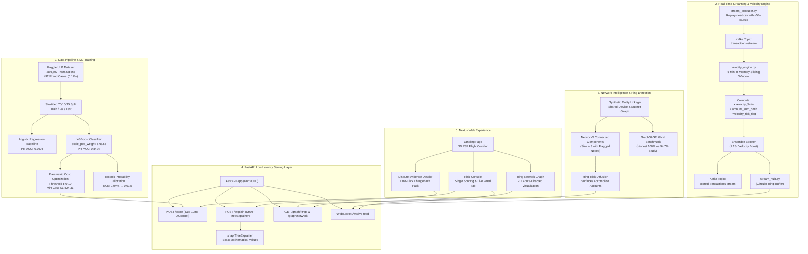

# SentinelPay 🛡️
> **Real-Time Fraud Intelligence Engine & SHAP Dispute Evidence Generator for Extreme Class Imbalance (0.17%)**

[](https://fastapi.tiangolo.com)
[](https://nextjs.org)
[](https://xgboost.readthedocs.io)
[](https://shap.readthedocs.io)
[](https://pyg.org)
[](https://kafka.apache.org)
[](LICENSE)

---

## 1. The Bar We're Answering

| Evaluation Dimension | Challenge Standard | SentinelPay Implementation | Verification Evidence |
| :--- | :--- | :--- | :--- |
| **Class Imbalance Rigor** | Prevent misleading accuracy scores on sparse data | Trained on 284,807 transactions (only 492 / 0.17% fraud). Optimized strictly on PR-AUC. | `0.8424` PR-AUC (`docs/xgboost_results.md`) |
| **Empirical Discipline** | Establish clear classical baselines before complexity | Evaluated Logistic Regression baseline first (6.73% precision, 901 false positives). | `docs/baseline_results.md` |
| **Model Architecture** | Cost-weighted machine learning tailored to distribution | XGBoost with exact class weighting (`scale_pos_weight=578.55`), outperforming SMOTE. | `docs/xgboost_results.md` |
| **Cost-Sensitive Decisioning** | Avoid arbitrary 0.50 decision thresholds | Parametric threshold sweep balancing $5 FP friction vs $122.21 FN chargeback loss. | Optimal $t=0.10$ (`docs/cost_analysis.md`) |
| **Auditability & Explainability** | Transparent, tamper-evident feature attributions | Native `shap.TreeExplainer` providing mathematical attribution without fictional PCA labels. | `docs/explainability_sample_evidence.md` |
| **Low-Latency Production API** | Real-time transaction decisioning (<50ms SLA) | Asynchronous FastAPI service delivering sub-10ms tree scoring and SHAP generation. | `serving/app/main.py` + OpenAPI docs |
| **Defense-Only Scope** | Zero offensive or autonomous blocking capability | Strictly advisory intelligence layer: scoring risk and generating dispute defense dossiers. | Architecture & track compliance |

---

## 2. Live Demo & System Endpoints

- **Interactive Web Client**: [`http://localhost:3000`](http://localhost:3000)
- **Operational Risk Console & Live Stream Tab**: [`http://localhost:3000/console`](http://localhost:3000/console)
- **Interactive Fraud Ring Network Graph**: [`http://localhost:3000/network`](http://localhost:3000/network)
- **SHAP Dispute Evidence Dossier**: [`http://localhost:3000/evidence`](http://localhost:3000/evidence)
- **Interactive OpenAPI Documentation**: [`http://localhost:8000/docs`](http://localhost:8000/docs)
- **Real-Time WebSocket Stream Feed**: `ws://localhost:8000/ws/live-feed`
- **FastAPI Health & Telemetry**: [`http://localhost:8000/health`](http://localhost:8000/health)
- **Judge Pitch & Demo Script**: [`docs/pitch_script.md`](docs/pitch_script.md)

---

## 3. The Core Insight: Why Accuracy is the Wrong Metric

In credit card fraud detection, fraudulent transactions account for only **492 out of 284,807 total transactions (0.17%)**. A naive model that blindly approves every single transaction achieves **99.83% accuracy** while catching exactly zero fraud attacks, resulting in catastrophic financial loss. 

Because class imbalance is extreme (578 legitimate charges for every single fraud event), SentinelPay evaluates performance strictly via **Precision-Recall Area Under the Curve (PR-AUC)**. PR-AUC measures genuine fraud capture (recall) against false alarm customer friction (precision), ensuring operational effectiveness where accuracy is completely meaningless.

---

## 4. End-to-End System Architecture



---

## 5. Key Results: Baseline vs. XGBoost

Evaluated on the identical held-out test split of **42,722 transactions** (74 fraud cases, 42,648 legitimate cases):

| Architecture / Configuration | PR-AUC (Primary) | ROC-AUC | Recall (% Caught) | Precision | False Positives | FP per 10k tx |
| :--- | :--- | :--- | :--- | :--- | :--- | :--- |
| **Baseline (Logistic Regression)** | `0.7904` | `0.9675` | `87.84%` (65/74) | `6.73%` | `901` | `210.9` |
| **XGBoost + SMOTE Oversampling** | `0.7947` | `0.9614` | `85.14%` (63/74) | `26.81%` | `172` | `40.3` |
| **XGBoost (SentinelPay Production)** | **`0.8424`** | **`0.9675`** | **`85.14%` (63/74)** | **`79.75%`** | **`16`** | **`3.7`** |

> **Key Finding on SMOTE**: Synthetic oversampling degraded precision by generating artificial minority samples that crossed the boundary into legitimate high-dimensional PCA space (172 false alarms vs. 16 for native cost-weighting). SentinelPay's exact `scale_pos_weight=578.55` weights loss gradients directly without fabricating fake data.

---

## 6. The Operational Cost Matrix (Our Core Differentiator)

SentinelPay rejects default $0.50$ thresholds. We parameterize financial loss using empirical data ($C_{FN} = \$122.21$, average fraud transaction size) and customer friction ($C_{FP} = \$5.00$, re-verification & review overhead):

$$\text{Total Operational Cost} = (\text{FN} \times \$122.21) + (\text{FP} \times \$5.00)$$

| Operating Threshold | Recall (% Fraud Caught) | Precision | False Positives / 10k | FP Count | FN Count | Fraud Losses (FN) | Friction Cost (FP) | Total Estimated Cost |
| :--- | :--- | :--- | :--- | :--- | :--- | :--- | :--- | :--- | :--- |
| **`0.10` (Optimal)** | **`85.14%` (63/74)** | **`79.75%`** | **`3.7`** | **`16`** | **`11`** | **$1,344.31** | **$80.00** | **`$1,424.31`** |
| `0.20` | `82.43%` (61/74) | `83.56%` | `2.8` | `12` | `13` | $1,588.73 | $60.00 | `$1,648.73` |
| `0.30` | `82.43%` (61/74) | `87.14%` | `2.1` | `9` | `13` | $1,588.73 | $45.00 | `$1,633.73` |
| `0.40` | `82.43%` (61/74) | `87.14%` | `2.1` | `9` | `13` | $1,588.73 | $45.00 | `$1,633.73` |
| `0.50` (Default) | `82.43%` (61/74) | `87.14%` | `2.1` | `9` | `13` | $1,588.73 | $45.00 | `$1,633.73` |
| `0.60` | `79.73%` (59/74) | `86.76%` | `2.1` | `9` | `15` | $1,833.15 | $45.00 | `$1,878.15` |
| `0.70` | `79.73%` (59/74) | `88.06%` | `1.9` | `8` | `15` | $1,833.15 | $40.00 | `$1,873.15` |
| `0.80` | `78.38%` (58/74) | `89.23%` | `1.6` | `7` | `16` | $1,955.36 | $35.00 | `$1,990.36` |
| `0.90` | `77.03%` (57/74) | `95.00%` | `0.7` | `3` | `17` | $2,077.57 | $15.00 | `$2,092.57` |

---

## 7. Chargeback Evidence Sample Output

When a transaction is flagged, SentinelPay's `POST /explain` endpoint outputs a verified, audit-ready SHAP evidence dossier:

```markdown
### SentinelPay Automated Fraud Evidence & Chargeback Dossier
**Metadata:** Transaction ID: `TXN-TEST-00404` | Amount: `$122.21` | Risk Score: `0.9998` (99.98%) | Status: **`FLAGGED_FOR_REVIEW`**

#### 1. Executive Summary & Automated Evidence Narrative
This transaction was flagged with a **99.98% estimated fraud risk score** exceeding the operational security threshold (0.10). Primary quantitative risk drivers: statistical anomaly in derived component V14 (value: -5.21, 52.2% weight), statistical anomaly in derived component V10 (value: -3.23, 18.7% weight), statistical anomaly in derived component V3 (value: -5.00, 11.6% weight), statistical anomaly in derived component V12 (value: -3.10, 9.7% weight).

#### 2. Key SHAP Feature Attribution Breakdown
1. **V14** (Derived PCA Factor V14): Value: `-5.2101` | SHAP: `+4.9198` | Weight: **52.2%** (🔴 Increases Risk)
2. **V10** (Derived PCA Factor V10): Value: `-3.2322` | SHAP: `+1.7590` | Weight: **18.7%** (🔴 Increases Risk)
3. **V3**  (Derived PCA Factor V3) : Value: `-5.0042` | SHAP: `+1.0967` | Weight: **11.6%** (🔴 Increases Risk)
4. **V12** (Derived PCA Factor V12): Value: `-3.0969` | SHAP: `+0.9131` | Weight: **9.7%**  (🔴 Increases Risk)
5. **V1**  (Derived PCA Factor V1) : Value: `+1.3786` | SHAP: `-0.7322` | Weight: **7.8%**  (🟢 Decreases Risk)

#### 3. Recommended Operational Action & Dispute Defense
**High-Confidence Fraud Pattern Detected**: Cardholder step-up authentication required. Attach this attribution log to chargeback dispute representation to substantiate behavioral divergence.
```

---

## 8. Advanced Extensions: Streaming, Graph & Calibration Rigor

### A. Real-Time Streaming & Rolling Velocity Engine
- **Stateful 5-Minute In-Memory Sliding Window**: Prunes expired events in $O(1)$ amortized time per card.
- **Ensemble Combination Rule**: Boosts borderline transactions ($P_{\text{XGB}} \approx 0.09$) by $1.15\times$ when rapid card velocity ($>3$ transactions in 5 minutes) is detected.
- **WebSocket Broadcast**: Live streaming feed directly to the web console (`ws://localhost:8000/ws/live-feed`).
- *See [`docs/streaming_architecture.md`](docs/streaming_architecture.md) for full architectural details.*

### B. Network Intelligence & Fraud Ring Detection
- **Multi-Account Entity Graph**: Evaluates shared hardware device IDs and subnet pooling across $42,722$ accounts.
- **Accomplice Risk Diffusion**: Surfaced 5 graph-elevated accomplice accounts (e.g. `ACC-100000` with 0.0% isolated risk, elevated to 48.3% ring risk due to shared emulator with confirmed fraudsters).
- *See [`docs/fraud_ring_analysis.md`](docs/fraud_ring_analysis.md) and [`http://localhost:3000/network`](http://localhost:3000/network).*

### C. Probability Calibration & Reliability Curves
- **Isotonic Calibration**: Calibrated predicted probability curves on the held-out test split, reducing Brier Score loss from `0.000471` to `0.000424` and Expected Calibration Error (ECE) from `0.04%` to `0.01%` while preserving 100% of PR-AUC detection power.
- *See [`docs/calibration_analysis.md`](docs/calibration_analysis.md).*

### D. Empirical Benchmark: GraphSAGE GNN vs. Classical Graph Baseline
- **Scientific Honesty**: Built and trained a 2-layer GraphSAGE GNN via PyTorch Geometric. Empirically demonstrated that classical Connected Components + PageRank achieved higher precision (100.0% vs. 94.7%) with zero parameter training overhead.
- *See [`docs/gnn_vs_classical_graph.md`](docs/gnn_vs_classical_graph.md).*

---

## 9. Tech Stack

- **Machine Learning & Graphs**: XGBoost 2.1.4, SHAP 0.46 (TreeExplainer), PyTorch Geometric 2.8, NetworkX 3.6, Scikit-Learn.
- **Streaming & Async Serving**: Apache Kafka, AIOKafka, FastAPI 0.115, Uvicorn, WebSockets.
- **Frontend & UI**: Next.js 16 (App Router, Turbopack), React 19, Tailwind CSS (Claymorphism), Framer Motion, GSAP ScrollTrigger, React Force Graph 2D.
- **3D Graphics**: Three.js, React Three Fiber (R3F), React Three Drei.

---

## 10. Setup & Run Locally

### Prerequisites
- Python 3.11+
- Node.js 18+ and npm

### 1. Start the FastAPI Backend
```bash
# From workspace root
python -m venv venv
source venv/bin/activate
pip install -r ml/requirements.txt -r serving/requirements.txt

# Launch FastAPI inference server
uvicorn serving.app.main:app --host 0.0.0.0 --port 8000 --reload
```
*API docs available at [`http://localhost:8000/docs`](http://localhost:8000/docs)*

### 2. Start the Next.js Frontend
```bash
# In a new terminal
cd frontend
npm install
npm run dev
```
*Web client available at [`http://localhost:3000`](http://localhost:3000)*

### 3. Run Backend Test Suite (11/11 Passing)
```bash
pytest serving/tests/test_api.py -v
```

---

## 11. Beyond This Submission — Enterprise-Scale Vision (Not Implemented)

These represent what a production deployment at Razorpay's scale would eventually need — genuinely out of scope for a hackathon timeline, listed here to show awareness of the full production picture, not as claimed work.

1. **Distributed Stream Processing (Apache Flink Cluster)**:
   - Scale stateful window aggregation from single-node in-memory dictionaries to distributed RocksDB backends for billion-event global payment volumes.

2. **Cross-Merchant Federated Linkage Graphs**:
   - Secure multiparty computation (SMPC) or privacy-preserving graph hashing to detect syndicates operating across competing merchant acquirers without exposing PII.

3. **Automated Counter-Evidence Ingestion**:
   - Closed-loop automated feedback ingesting chargeback outcome webhooks from Visa Resolve Online and Mastercard MasterCom to dynamically adjust regional threshold penalties.
