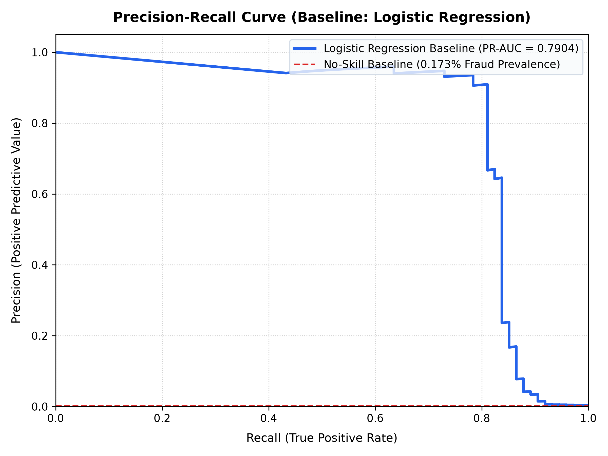

# SentinelPay - ML Baseline Model Report

## 1. Overview & Benchmark Objective
Before training complex models (such as Gradient Boosted Trees / XGBoost, Deep Neural Networks, or Graph Ensembles), we establish an honest, reproducible baseline using **Logistic Regression with Balanced Class Weights**.

This baseline serves as the benchmark: **Any complex model (e.g., XGBoost) must comfortably beat this PR-AUC number to justify its operational and computational complexity.**

---

## 2. Baseline Model Performance

| Metric | Baseline Score | Interpretation / Target |
| :--- | :--- | :--- |
| **PR-AUC (Primary)** | **`0.7904`** | **Primary benchmark to beat** (Precision-Recall Area Under Curve) |
| **ROC-AUC (Comparative)** | **`0.9675`** | Misleadingly optimistic due to massive True Negative pool |
| **Recall (Class 1)** | **`0.8784` (87.84%)** | Proportion of actual fraud caught (65/74) |
| **Precision (Class 1)** | **`0.0673` (6.73%)** | Proportion of flagged alerts that were genuine fraud |
| **F1-Score (Class 1)** | **`0.1250`** | Harmonic mean of Precision and Recall |

### Test Set Confusion Matrix
- **Total Test Transactions**: 42,722 (Fraud cases: 74)
- **True Positives (Fraud caught)**: `65` / 74 (87.8%)
- **False Negatives (Fraud missed)**: `9`
- **True Negatives (Legitimate passed)**: `41,747`
- **False Positives (False alarms)**: `901`

---

## 3. Why PR-AUC Over ROC-AUC for Fraud Detection

### The Problem with Accuracy
In this dataset, legitimate transactions make up **99.83%** of all samples (42,648 out of 42,722 in the test set). 
A dummy classifier that predicts *zero* (legitimate) for every single transaction achieves **99.83% accuracy**, yet catches **0% of fraud** (Recall = 0, financial loss = 100%). Accuracy is thus completely invalid.

### The Problem with ROC-AUC under Extreme Imbalance (~0.17% Fraud)
ROC curves plot the True Positive Rate ($TPR = \frac{TP}{TP + FN}$) against the False Positive Rate ($FPR = \frac{FP}{FP + TN}$).
- Because the number of legitimate transactions ($TN$) is massive (~42,648 in test split), even a large number of false alarms (e.g. 901 false positives) results in a tiny FPR:
  $$\text{FPR} = \frac{901}{901 + 41747} = 0.0211$$
- This compresses the False Positive axis and inflates the ROC-AUC to a deceptively stellar **`0.9675`**, masking severe false positive pollution.

### Why Precision-Recall AUC (PR-AUC) is the Honest Metric
Precision-Recall curves plot Precision ($PPV = \frac{TP}{TP + FP}$) directly against Recall ($TPR = \frac{TP}{TP + FN}$):
- The metric directly contrasts true fraud detections against false customer frictions (false alarms), without being diluted by the immense volume of true negatives.
- The baseline PR-AUC of **`0.7904`** accurately reflects the performance trade-off between catching fraud and managing operational review costs.

---

## 4. Precision-Recall Curve

---

## 5. Target for Future Iterations (XGBoost / Advanced Architectures)
- **Baseline PR-AUC to beat**: **`0.7904`**
- Next step: Train an XGBoost model with hyperparameter tuning, scale_pos_weight optimization, and evaluate feature importance / SHAP values to push PR-AUC above this baseline.
