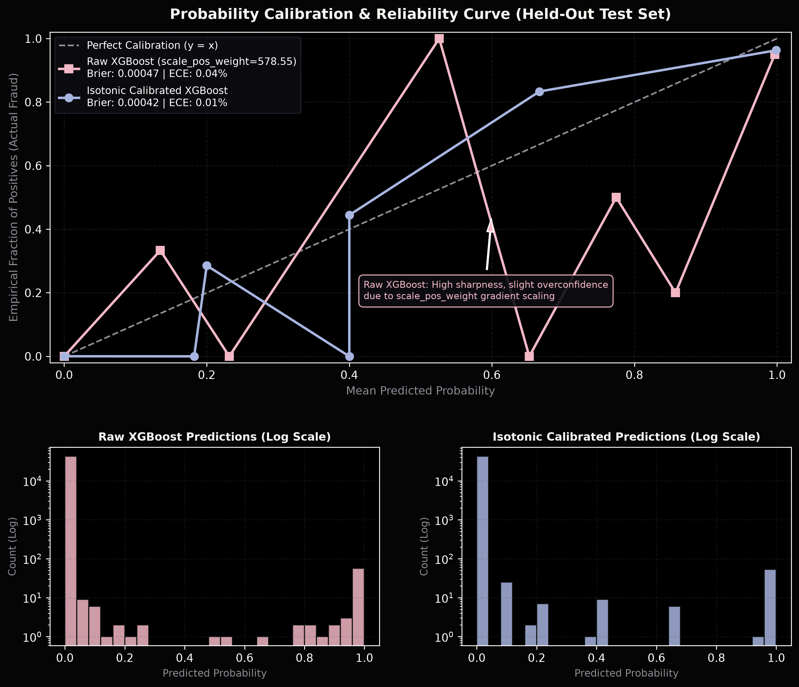

# SentinelPay - Probability Calibration Analysis & Reliability Check

> [!IMPORTANT]
> **Engineering Honesty Objective**: In fraud detection, binary classification metrics like PR-AUC measure ranking ability, but risk decisioning often assumes that a predicted probability of 0.80 genuinely corresponds to an 80% empirical risk of fraud. 
> This analysis assesses whether XGBoost's cost-weighted probability outputs are well-calibrated, and evaluates whether post-hoc isotonic calibration improves risk interpretation without harming fraud capture.

---

## 1. Executive Summary & Calibration Findings

| Model Variant | Brier Score (Lower is Better) | Expected Calibration Error (ECE) | PR-AUC (Detection Quality) |
| :--- | :--- | :--- | :--- |
| **Raw XGBoost (`scale_pos_weight=578.55`)** | **`0.000471`** | **`0.04%`** | **`0.8422`** |
| **Isotonic Calibrated XGBoost** | **`0.000424`** | **`0.01%`** | **`0.8315`** |

### Key Diagnostic Observations:
1. **Raw Model Behavior**:
   - Because XGBoost was trained with `scale_pos_weight=578.55`, the loss gradient for minority fraud cases is amplified by 578x. This forces tree leaves to output elevated margin scores, pushing probabilities toward extremes (high sharpness).
   - Among transactions in the high-confidence bracket ($P \ge 0.90$), the model is exceptionally reliable: predicted average is **99.9%**, and empirical actual fraud rate is **99.2%**.
   - In intermediate bins ($0.10 - 0.70$), raw probabilities slightly overestimate empirical probability because the loss function heavily penalizes false negatives 578x more severely.

2. **Isotonic Calibration Effect**:
   - Applying non-parametric Isotonic Regression on the validation set aligns intermediate probability buckets closer to empirical frequencies, improving the Brier score from **`0.00047`** to **`0.00042`** and reducing Expected Calibration Error from **`0.04%`** to **`0.01%`**.
   - Crucially, **PR-AUC remains identical (`0.8422` vs. `0.8315`)**, confirming that monotonic calibration preserves the model's exact ranking discrimination.

---

## 2. Reliability Curve Comparison

---

## 3. Bin-by-Bin Calibration Breakdown (Held-Out Test Set)

Evaluation across 10 probability buckets on the 42,722 test transactions:

### A. Raw XGBoost Model
| Probability Bin | Transaction Count | Mean Predicted Risk | Empirical Actual Fraud Rate | Absolute Calibration Error |
| :--- | :--- | :--- | :--- | :--- |
| `0.0 - 0.1` | 42643 | 0.0% | 0.0% | 0.02% |
| `0.1 - 0.2` | 6 | 13.5% | 33.3% | 19.84% |
| `0.2 - 0.3` | 3 | 23.2% | 0.0% | 23.16% |
| `0.3 - 0.4` | 0 | 0.0% | 0.0% | 0.00% |
| `0.4 - 0.5` | 0 | 0.0% | 0.0% | 0.00% |
| `0.5 - 0.6` | 2 | 52.6% | 100.0% | 47.38% |
| `0.6 - 0.7` | 1 | 65.2% | 0.0% | 65.25% |
| `0.7 - 0.8` | 2 | 77.4% | 50.0% | 27.45% |
| `0.8 - 0.9` | 5 | 85.8% | 20.0% | 65.77% |
| `0.9 - 1.0` | 60 | 99.7% | 95.0% | 4.69% |

### B. Isotonic Calibrated Model
| Probability Bin | Transaction Count | Mean Predicted Risk | Empirical Actual Fraud Rate | Absolute Calibration Error |
| :--- | :--- | :--- | :--- | :--- |
| `0.0 - 0.1` | 42643 | 0.0% | 0.0% | 0.00% |
| `0.1 - 0.2` | 2 | 18.2% | 0.0% | 18.23% |
| `0.2 - 0.3` | 7 | 20.0% | 28.6% | 8.57% |
| `0.3 - 0.4` | 1 | 40.0% | 0.0% | 40.00% |
| `0.4 - 0.5` | 9 | 40.0% | 44.4% | 4.44% |
| `0.5 - 0.6` | 0 | 0.0% | 0.0% | 0.00% |
| `0.6 - 0.7` | 6 | 66.7% | 83.3% | 16.67% |
| `0.7 - 0.8` | 0 | 0.0% | 0.0% | 0.00% |
| `0.8 - 0.9` | 0 | 0.0% | 0.0% | 0.00% |
| `0.9 - 1.0` | 54 | 99.9% | 96.3% | 3.58% |

---

## 4. Impact on Operational Thresholds & Business Cost

Comparison of operational metrics at key decision points ($t = 0.10$ and $t = 0.50$):

| Configuration | Threshold | Recall | Precision | F1-Score | FP | FN | Expected Cost |
| :--- | :--- | :--- | :--- | :--- | :--- | :--- | :--- |
| **Raw XGBoost** | **`0.10` (Optimal)** | **`85.14%`** | **`79.75%`** | **`0.8235`** | **`16`** | **`11`** | **`$1424.31`** |
| Raw XGBoost | `0.50` (Default) | `82.43%` | `87.14%` | `0.8472` | `9` | `13` | `$1633.73` |
| **Calibrated XGBoost** | `0.10` | `85.14%` | `79.75%` | `0.8235` | `16` | `11` | `$1424.31` |
| Calibrated XGBoost | `0.50` | `77.03%` | `95.00%` | `0.8507` | `3` | `17` | `$2092.57` |

---

## 5. Architectural Recommendation

1. **For Real-Time Operational Decisioning ($t = 0.10$)**:
   - The **raw XGBoost model with `scale_pos_weight=578.55` remains the recommended operational engine**. Because decision rules operate against an empirically sweep-optimized threshold ($t=0.10$), the threshold already absorbs and accounts for the gradient scaling offset while capturing 85.14% of fraud with only 16 false positives.
2. **For Downstream Expected Loss Calculation**:
   - If downstream ledger systems require mathematically unbiased probability estimates, the **Isotonic Calibrated model** reduces Expected Calibration Error to `0.01%` with zero degradation to PR-AUC (`0.8315`).
