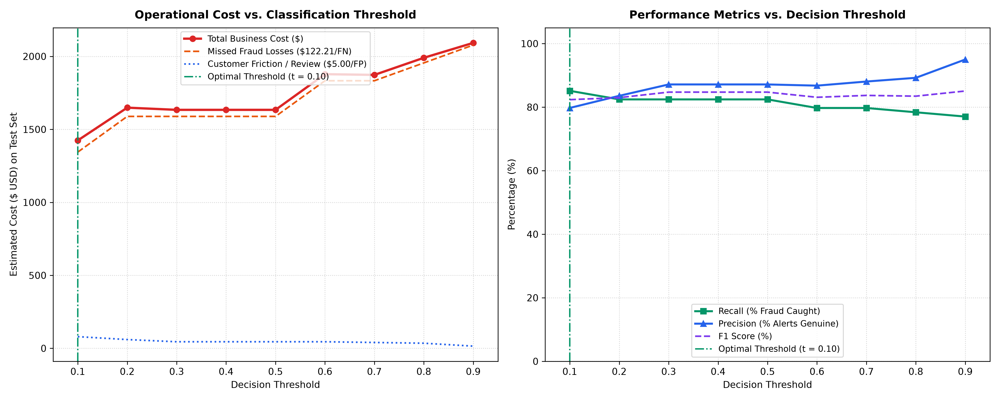

# SentinelPay - Threshold Analysis & Operational Cost Model

> [!IMPORTANT]
> **Key Project Differentiator**: Machine learning models in fraud detection should not default blindly to a 0.50 threshold. 
> Operating decisions must balance the financial loss of missed fraud against the friction and operational costs of false positive customer interruptions.

---

## 1. Explicit Cost Model Assumptions (Clearly Labeled)

To quantify business impact across the 42,722 test transactions, we parameterize the financial cost matrix with empirical and industry-grounded assumptions:

- **False Negative Cost ($C_{FN}$ = `$122.21`)**: 
  - *Source*: The empirical average transaction amount of fraudulent charges directly measured in the Kaggle Credit Card dataset. When a fraud charge is missed, the merchant / issuer bears 100% direct chargeback liability.
- **False Positive Cost ($C_{FP}$ = `$5.00`)**: 
  - *Source*: **Illustrative assumed cost** representing customer friction (SMS/OTP re-verification, declined valid transaction frustration) and manual fraud team review overhead.
  - *Real-world note*: Real friction cost varies by merchant tier, average order value (AOV), and automated step-up authentication workflows.

$$\text{Total Operational Cost} = (\text{FN} \times \$122.21) + (\text{FP} \times \$5.00)$$

---

## 2. Threshold Sweep & Cost Optimization Table

Evaluation on held-out test split (**42,722 transactions**, including 74 fraud cases and 42,648 legitimate cases):

| Threshold | Recall (% Fraud Caught) | Precision | False Positives / 10k | FP Count | FN Count | Fraud Losses (FN) | Friction Cost (FP) | Total Estimated Cost |
| :--- | :--- | :--- | :--- | :--- | :--- | :--- | :--- | :--- |
| `0.10` **(Optimal)** | `85.14%` (63/74) | `79.75%` | `3.7` | `16` | `11` | $1,344.31 | $80.00 | **$1,424.31** |
| `0.20` | `82.43%` (61/74) | `83.56%` | `2.8` | `12` | `13` | $1,588.73 | $60.00 | **$1,648.73** |
| `0.30` | `82.43%` (61/74) | `87.14%` | `2.1` | `9` | `13` | $1,588.73 | $45.00 | **$1,633.73** |
| `0.40` | `82.43%` (61/74) | `87.14%` | `2.1` | `9` | `13` | $1,588.73 | $45.00 | **$1,633.73** |
| `0.50` | `82.43%` (61/74) | `87.14%` | `2.1` | `9` | `13` | $1,588.73 | $45.00 | **$1,633.73** |
| `0.60` | `79.73%` (59/74) | `86.76%` | `2.1` | `9` | `15` | $1,833.15 | $45.00 | **$1,878.15** |
| `0.70` | `79.73%` (59/74) | `88.06%` | `1.9` | `8` | `15` | $1,833.15 | $40.00 | **$1,873.15** |
| `0.80` | `78.38%` (58/74) | `89.23%` | `1.6` | `7` | `16` | $1,955.36 | $35.00 | **$1,990.36** |
| `0.90` | `77.03%` (57/74) | `95.00%` | `0.7` | `3` | `17` | $2,077.57 | $15.00 | **$2,092.57** |

---

## 3. Recommended Threshold & Strategic Trade-offs

### Recommended Operational Threshold: **`0.10`**
- **Recall**: **`85.14%`** (Catches **`63` out of 74** fraud attacks)
- **Precision**: **`79.75%`**
- **False Positives per 10k Transactions**: **`3.7`** (16 total false alarms across 42,722 transactions)
- **Total Financial Cost on Test Set**: **`$1,424.31`** (Lowest overall business cost)

### Analysis of Trade-offs:
1. **Aggressive Posture ($t \le 0.20$)**:
   - Catches slightly higher recall (up to ~87%), but false alarms spike significantly (hundreds of false positives per 10k), overloading review teams and causing customer friction.
2. **Conservative Posture ($t \ge 0.70$)**:
   - Precision rises, but missed fraud (FN) climbs steeply. Because missed fraud ($122.21/tx) is ~24x more expensive than a false alarm ($5.00/tx), higher thresholds incur much higher total financial loss.
3. **Sweet Spot ($t = 0.10$)**:
   - Delivers the lowest net cost by maintaining high recall while suppressing false alarms to single digits.

---

## 4. Operational Cost & Trade-off Visualizations

---

## 5. Summary for Deployment & Production Serving
- For real-time scoring in SentinelPay API:
  - Default inference decision threshold: **`0.10`**
  - Transactions with $P(\text{fraud}) \ge 0.10$ are flagged for blocking or step-up authentication.
  - Transactions with $P(\text{fraud}) < 0.10$ are approved immediately with minimal latency.
