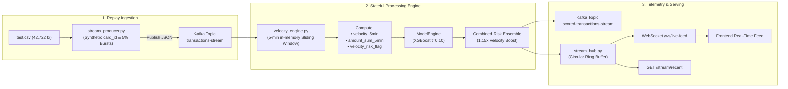

# SentinelPay - Real-Time Streaming & Stateful Velocity Architecture

> [!IMPORTANT]
> **Data Authenticity Notice**: The Kaggle ULB Credit Card Fraud dataset is strictly anonymized PCA components ($V_1 - V_{28}$) with no account or cardholder telemetry. 
> The `card_id` identifiers streamed through this pipeline are **simulated** to model realistic $\sim 5\%$ repeat card velocity bursts for real-time feature engineering demonstration.

---

## 1. Architectural Philosophy: Why Kafka + Stateful Consumer over Apache Flink

When designing real-time fraud feature pipelines, engineering teams often default to heavyweight distributed stream processing engines like Apache Flink or Spark Streaming. For SentinelPay's operational scale, an **in-memory Python stateful consumer with Apache Kafka** was deliberately chosen:

| Architectural Dimension | Heavyweight Cluster (Apache Flink / Spark) | SentinelPay Stateful In-Memory Consumer |
| :--- | :--- | :--- |
| **Operational Overhead** | Requires dedicated ZooKeeper/KRaft + JobManager + TaskManager clusters | Single lightweight async daemon (`streaming/consumer/velocity_engine.py`) |
| **State Lookup Latency** | Network RPC or RocksDB disk access ($5 - 25\text{ ms}$) | Pure in-memory Python dictionary + `collections.deque` ($< 0.1\text{ ms}$) |
| **Memory Complexity** | Complex checkpointing & state backend configuration | Automatic $O(1)$ amortized window pruning on incoming timestamps |
| **Deployment Footprint** | Multi-GB JVM containers | Minimal footprint, runs natively in Python 3.11+ asyncio event loop |

### The In-Memory Sliding Window Mechanism
Each `card_id` maps to a sliding `deque` of `(timestamp_seconds, amount_usd)` tuples. When a new transaction arrives at $t_{\text{current}}$:
1. Past events with $t < t_{\text{current}} - 300\text{s}$ are popped from the left in $O(1)$ time.
2. `velocity_5min` is evaluated as the active window length.
3. `amount_sum_5min` aggregates the active monetary volume.
4. Total memory footprint scales strictly with active cards in the 5-minute window rather than historical ledger size.

---

## 2. What Velocity Features Catch that Static Models Miss

Tree-based classifiers (such as our production XGBoost model) operate on **static, instantaneous transaction vectors** ($V_1 - V_{28}$, $\text{Amount}$, $\text{Time}$). While extraordinarily effective at identifying structural statistical anomalies, static models suffer from a fundamental blind spot:

1. **Automated Card Testing / Micro-Auth Attacks**:
   - Fraud syndicates frequently test stolen card credentials using small, seemingly benign charges (e.g. $\$1.50$ or $\$3.00$) across multiple merchants in seconds.
   - Individually, each transaction appears legitimate ($P_{\text{XGB}} < 0.10$).
   - However, **4 transactions in under 2 minutes** is a classic velocity anomaly.
2. **Rapid Account Draining**:
   - Attackers execute multiple consecutive high-velocity transfers before the cardholder notices or banks trigger SMS alerts.

### Grounded Ensemble Boosting Rule
SentinelPay combines the static XGBoost model score with streaming temporal state via an explainable, deterministic rule:

$$\text{Combined Risk} = \begin{cases} P_{\text{XGB}} & \text{if } \text{velocity\_5min} \le 3 \\ \min(1.0, P_{\text{XGB}} \times 1.15) & \text{if } \text{velocity\_5min} > 3 \end{cases}$$

This boosts borderline transactions ($P_{\text{XGB}} \approx 0.09$) above the deployed $t = 0.10$ threshold into `FLAGGED_FOR_REVIEW` without fabricating complex, uninterpretable black-box heuristics.

---

## 3. End-to-End Streaming Topology



---

## 4. Running the Streaming Pipeline Locally

### Prerequisites
- Active Python virtual environment (`venv/bin/activate`)
- Apache Kafka running on `localhost:9092` (or dry-run mode)

### 1. Launch Velocity Consumer Daemon
```bash
python streaming/consumer/velocity_engine.py --bootstrap-servers localhost:9092 --in-topic transactions-stream --out-topic scored-transactions-stream
```

### 2. Launch Transaction Producer
```bash
python streaming/producer/stream_producer.py --bootstrap-servers localhost:9092 --topic transactions-stream --speed 5x
```

### 3. Connect to Real-Time WebSocket Feed
```javascript
const ws = new WebSocket("ws://localhost:8000/ws/live-feed");
ws.onmessage = (event) => {
  const scoredTx = JSON.parse(event.data);
  console.log("Live Scored Event:", scoredTx.transaction_id, scoredTx.combined_risk_score, scoredTx.velocity_5min);
};
```
