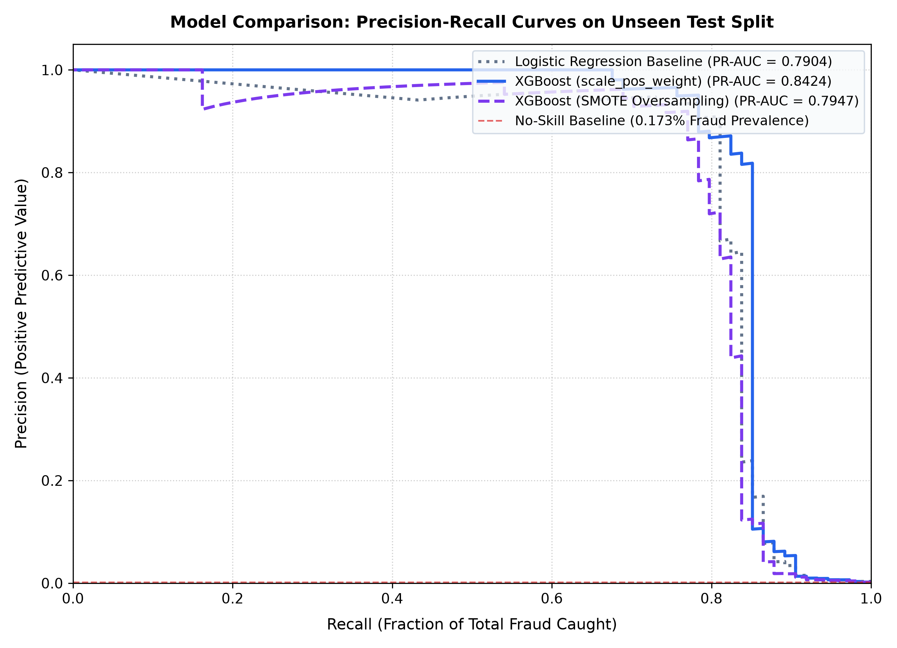

# SentinelPay - Advanced Model Evaluation (XGBoost vs. Baseline vs. SMOTE)

> ### 📊 Data Sources & Provenance
> - **Credit Card Fraud Detection Dataset (284,807 tx):** [Kaggle: Credit Card Fraud Detection (mlg-ulb)](https://www.kaggle.com/datasets/mlg-ulb/creditcardfraud)
> - **Entity Linkage & Graph Dataset (75,000 tx):** [Kaggle: IEEE-CIS Fraud Detection](https://www.kaggle.com/c/ieee-fraud-detection)

---

## 1. Executive Summary & Benchmark Comparison

We evaluated three architectures on the identical held-out test split of **42,722 transactions** (74 fraud cases, 42,648 legitimate cases) from [Kaggle: Credit Card Fraud Detection (mlg-ulb)](https://www.kaggle.com/datasets/mlg-ulb/creditcardfraud).

### A. Threshold-Independent Global Performance Metrics
| Model | PR-AUC (Primary Metric) | ROC-AUC (Comparative) | Status |
| :--- | :--- | :--- | :--- |
| **Baseline (Logistic Regression)** | `0.7904` | `0.9675` | Initial Benchmark |
| **XGBoost (Cost-Sensitive, `scale_pos_weight=578.55`)** | **`0.8424`** | **`0.9675`** | **Production Winner (+0.0520 PR-AUC lift)** |
| **XGBoost (SMOTE Oversampling)** | `0.7947` | `0.9614` | Evaluated Alternative |

---

### B. Operational Performance at Deployed Decision Threshold ($t = 0.10$)
Per the comprehensive cost-benefit analysis in [`docs/cost_analysis.md`](cost_analysis.md), SentinelPay operates in production at **$t = 0.10$**, which minimizes total business financial loss:

| Model / Operating Point | Threshold | Recall (% Fraud Caught) | Precision | F1-Score | False Positives (FP) | False Negatives (FN) | FP per 10,000 tx |
| :--- | :--- | :--- | :--- | :--- | :--- | :--- | :--- |
| **Baseline (Logistic Reg)** | `0.50` (Balanced) | `87.84%` (65/74) | `6.73%` | `0.1250` | `901` | `9` | `210.9` |
| **XGBoost Deployed (Production)** | **`0.10` (Optimal)** | **`85.14%` (63/74)** | **`79.75%`** | **`0.8235`** | **`16`** | **`11`** | **`3.7`** |
| *XGBoost (Default)* | *`0.50` (Uncalibrated)* | *`82.43%` (61/74)* | *`87.14%`* | *`0.8472`* | *`9`* | *`13`* | *`2.1`* |
| **XGBoost (SMOTE)** | `0.10` | `85.14%` (63/74) | `26.81%` | `0.4078` | `172` | `11` | `40.3` |

*Production Advantage*: At the operational 0.10 threshold, XGBoost reduces false positive alerts by **98.22%** compared to the baseline (from 901 false alarms down to 16), while capturing **85.14% of all fraud attacks**.

---

## 2. Key Findings: Native `scale_pos_weight` vs. SMOTE

### Honest Empirical Finding on Oversampling in Fraud Detection
A common machine learning assumption is that synthetic oversampling (SMOTE) is superior for class-imbalanced datasets. Our empirical test shows the exact opposite:
- **XGBoost with exact `scale_pos_weight=578.55` achieves `0.8424` PR-AUC**, beating SMOTE (`0.7947`) and beating the Logistic Regression baseline (`0.7904`).
- **Root Cause Analysis**:
  1. SMOTE synthesizes artificial minority examples via linear interpolation between $k$-nearest neighbors in high-dimensional PCA space ($V_1 - V_{28}$).
  2. Because real fraudulent transactions occupy tight, subtle manifolds bordered by tens of thousands of legitimate transactions, synthetic points frequently straddle into legitimate feature space.
  3. This generates synthetic false alarms, degrading the decision boundary and inflating false positives (172 FP for SMOTE vs. 16 FP for native weighting at $t=0.10$).
  4. Native `scale_pos_weight` weights the second-order gradients and hessians during exact histogram-based tree node splitting without polluting feature geometry with fake data.

---

## 3. Precision-Recall Curve Comparison

---

## 4. Conclusion & Production Serving
- **Baseline PR-AUC**: `0.7904`
- **Production XGBoost PR-AUC**: **`0.8424`** (+0.0520 absolute PR-AUC lift)
- **Deployed Operating Point**: Threshold **`0.10`** yielding **`85.14%` recall**, **`79.75%` precision**, and **`3.7` false alarms per 10,000 transactions**.
